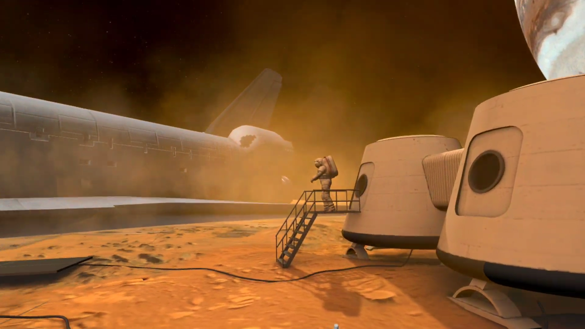

# MARS Mission Explorer - Immersive Explorer Systems

## 💡 Introduction
In an age where space exploration and technology continue to capture the imagination of people worldwide, the need for innovative and engaging educational platforms is paramount. The **MARS Mission Explorer** VR project aims to bridge this gap by offering a captivating and interactive experience that allows users to disassemble and reassemble the equipment and rovers utilized in NASA's Mars missions. By combining the immersive capabilities of virtual reality with the fascination surrounding space exploration, this project aspires to provide an effective and enjoyable way to educate individuals about the intricacies of space technology.

## 💡 Background
NASA's Mars missions have consistently garnered public interest due to their scientific significance and technological complexity. However, comprehending the intricate machinery and equipment used in these missions can be challenging, especially for those without a technical background. The *MARS Mission Explorer* project seeks to address this challenge by leveraging the power of virtual reality to offer an engaging and educational experience that demystifies the various components of Mars exploration technology.

## 💡 Methodology
The *MARS Mission Explorer* project was developed using the Unity Engine, a versatile and widely used game development platform. The VR aspect was realized through integration with Oculus VR hardware, which provided a seamless and immersive experience for users. The project's methodology consisted of several key steps:

1. **Content Gathering:** Thorough research was conducted to gather accurate and up-to-date information about NASA's Mars missions, the equipment used, and the rovers deployed.
2. **3D Modeling:** Detailed 3D models of the equipment, rovers, and their individual components were acquired from NASA’s Resource Library [here](https://nasa3d.arc.nasa.gov/models).
3. **Oculus Integration:** The Unity project was integrated with Oculus VR hardware to provide a fully immersive experience. This involved optimizing the project for performance within the VR environment.
4. **Environment Design:** The 3D models were imported into the Unity Engine, where a virtual environment resembling Mars' surface was created. Users could explore this environment and interact with the equipment.
5. **Interactivity Implementation:** Using Unity's scripting capabilities, interactive features were programmed to enable users to select and manipulate various components. The disassembly and reassembly processes were guided to ensure a structured learning experience.

## 💡 Results
The effectiveness of the *MARS Mission Explorer* VR project in educating individuals about space exploration and technology is assumed to yield the following results:

- **Enhanced Engagement:** The immersive nature of VR is expected to capture users' attention more effectively than traditional educational methods, leading to increased engagement.
- **Better Comprehension:** By allowing users to disassemble and reassemble equipment virtually, the project aims to provide a deeper understanding of the components' functionalities and their roles in space missions.
- **Memorable Learning:** The interactive and experiential approach is likely to create memorable learning experiences, aiding knowledge retention.
- **Accessible Learning:** VR breaks geographical barriers, enabling users from around the world to access the same educational content, democratizing space education.
- **Inspiration and Interest:** Engaging with the technology that powers Mars exploration might inspire users to pursue careers in science, technology, engineering, and mathematics (STEM) fields.

## 💡 Conclusion
The **MARS Mission Explorer** presents a compelling case for the effectiveness of virtual reality in education, especially in the realm of space exploration and technology. By leveraging Unity Engine and Oculus integration, the project offers an immersive and interactive learning experience that has the potential to enhance engagement, comprehension, and inspiration among users. While specific results will require empirical assessment, the project stands as a promising step toward using cutting-edge technology to educate and inspire the next generation of space enthusiasts and professionals.

## 💡 Demonstration
